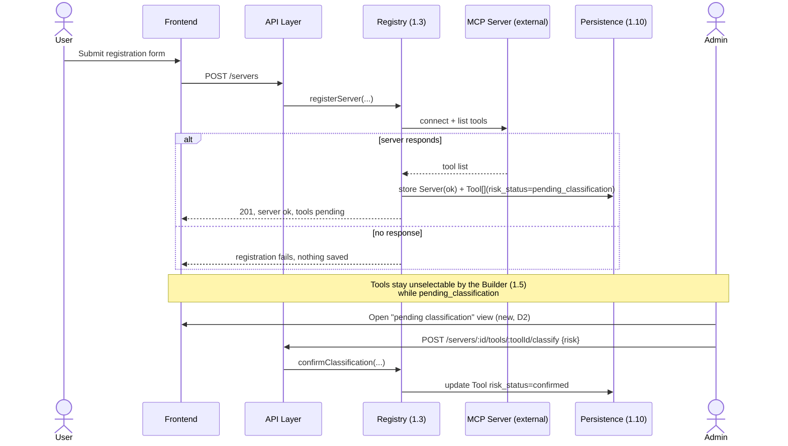
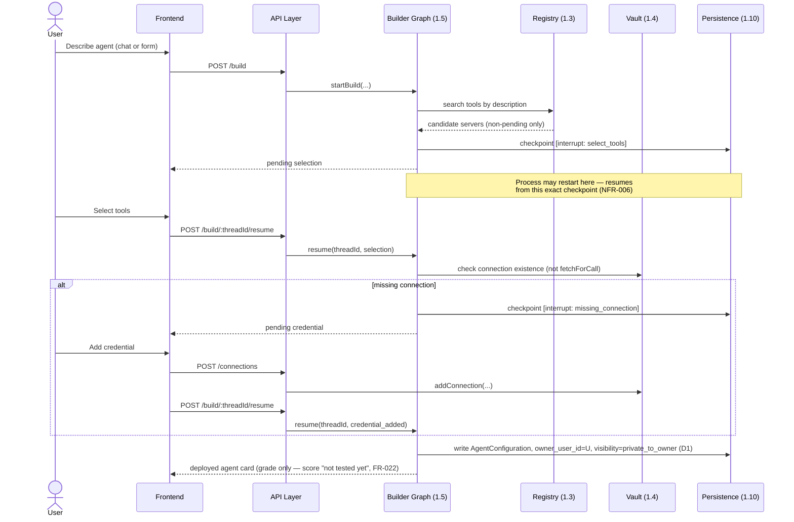
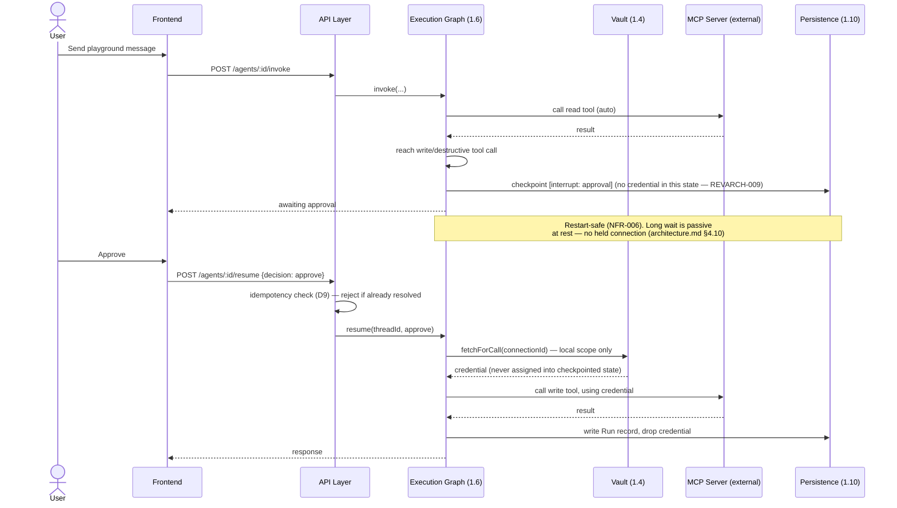
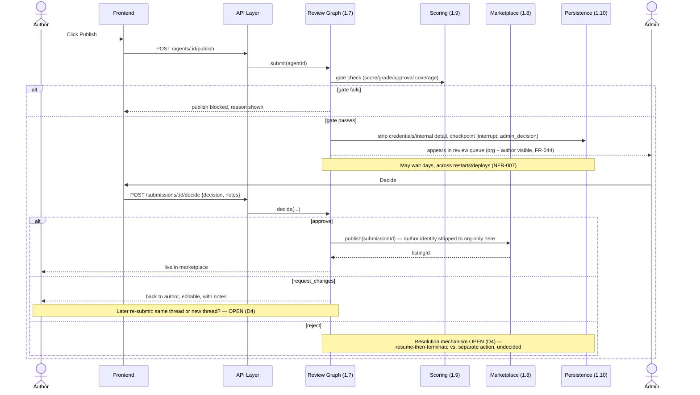
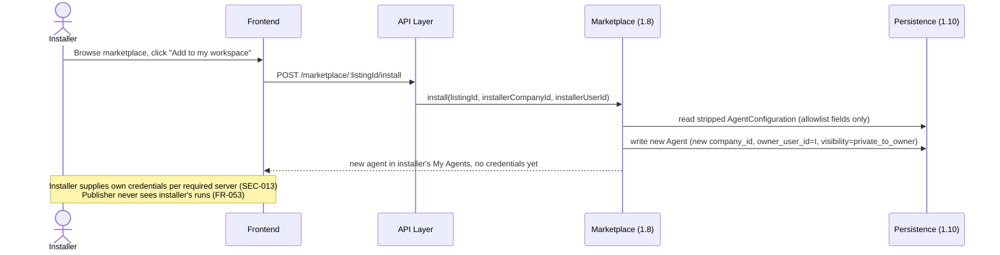

# Forge — High-Level Design

**Status:** HLD-level. Per `CLAUDE.md`'s workflow, this document sits between ARCHITECTURE REVIEW (complete —
`architecture/architecture-review.md`, all justified findings applied to `architecture/architecture.md`) and
the next HLD REVIEW gate. **This document does not repeat `architecture.md`** — read that first for the
pre-design analysis, the three alternatives, why Alternative A (modular monolith + Postgres RLS) was selected,
and the argument against that selection. This document decomposes that approved architecture's twelve
components into interfaces, data ownership, and interaction sequences, and does not re-derive any of it.

**Sources:** `problem-statement/`, `specs/spec.md`, `specs/traceability.md`, `architecture/architecture.md`,
`architecture/architecture-review.md`. No LLD content (no classes, no column-level schemas) — that's the next
gate.

---

## 0. Decisions made for this document (asked before finalizing, per instruction)

Nine HLD-level decisions carried genuine ambiguity. Four were put to the user before writing anything below;
five are recorded as assumptions per `CLAUDE.md` rule 9 (clarification not sought — none were judged to
materially change the architecture the way the first four do).

| # | Decision | Capstone-justified, or assumption? | Resolution |
|---|---|---|---|
| D1 | RLS isolation shape: company-only, or company + owner-user? | Genuinely ambiguous in source — see below | **Company + owner-user**, chosen by the user after reviewing the exact source (`AGENT` Settings tab's "Private to you"/"Change" card and the separate "Visible to: you only" field, `agent.html` ~L352-361 and ~L177) against the mixed "user" vs. "company" wording across graded check 1, check 9, and `MYAG:43`. |
| D2 | Tool-risk-classification mechanism | Assumption — brief never says how | **Manual review, with a new `pending_classification` state**, chosen by the user. No mockup shows this state or its UI — flagged explicitly as an addition beyond source material, owner-approved. |
| D3 | Admin account provisioning mechanism | Assumption — brief never says | **Left open** — user chose "decide later." HLD specifies enforcement fully, provisioning not at all. |
| D4 | Reject / resubmission semantics on the Review workflow | Ambiguous — source shows the icons differ but never states the mechanism | **Left open** — user chose "decide later." Both diagrammed as explicit unresolved branches, not defaulted. |
| D5 | Scheduling: display field or real executor | `spec.md §16` item 1, still deferred | **Assumption: display-only.** No Scheduler component in this HLD. Lower-stakes than D1-D4 (doesn't gate any diagram below) — recorded, not asked, per minimum-necessary-complexity. |
| D6 | Checkpointer library's RLS-session-variable compatibility | Assumption — technical detail below the architecture's stated constraint (`architecture.md` §4.10) | **Assumption: verify at LLD/build time; default to company-partitioned checkpoint rows enforced by a non-bypassable constraint, checked at resume,** if the chosen library can't be proven to honor per-request RLS session variables. |
| D7 | Session/auth token mechanism (cookie vs. bearer) | Assumption — brief silent | **Bearer JWT**, for one mechanism shared between the SPA session and the public agent API (`API-005` already implies bearer tokens) rather than two auth schemes. |
| D8 | Credential encryption approach | Assumption — brief only says "encrypted" | **Symmetric key via Docker secret / env var**, not a KMS — matches `NG4`/`C3` (no paid account) and minimum-necessary-complexity. |
| D9 | Idempotency-key mechanism for resume/invoke (`architecture.md` REVARCH-011) | Assumption — architecture named the constraint, not the mechanism | **No client-supplied key needed** — a resume action is already uniquely addressed by `(thread_id, decision)`; the Persistence Layer enforces at-most-once by rejecting a resume against an already-resolved interrupt. |

D1/D2 resolve `spec.md §16` items 10 and 11. **Fix, HLDREV-003:** `spec.md` and `architecture.md` have been
updated in this revision to record that resolution — see `spec.md §16` items 10/11 and `architecture.md §7`,
both now marked resolved rather than open, so the three documents no longer disagree about their status.

**This revision applies every finding from `architecture/hld-review.md`** (HLDREV-001 through HLDREV-012); each
fix below is marked inline at the point it lands.

---

## 1. Component decomposition

Twelve components, one-to-one with `architecture.md` §4 — no component added or removed. Interfaces below are
named for interaction purposes; exact request/response shapes are LLD.

**Architecture ↔ HLD crosswalk** (fix, HLDREV-011 — previously implicit, reconstructed and added here):

| `architecture.md` §4 | `hld.md` §1 |
|---|---|
| 4.1 API Layer | 1.1 API Layer |
| 4.2 Identity & Session | 1.2 Identity & Session |
| 4.3 MCP Registry & Introspection | 1.3 MCP Registry & Introspection |
| 4.4 Credential Vault | 1.4 Credential Vault |
| 4.5 Agent Builder Graph | 1.5 Agent Builder Graph |
| 4.6 Agent Execution Graph | 1.6 Agent Execution Graph |
| 4.7 Scoring Engine | 1.9 Scoring Engine |
| 4.8 Publish & Admin Review Graph | 1.7 Publish & Admin Review Graph |
| 4.9 Marketplace & Install | 1.8 Marketplace & Install |
| 4.10 Checkpointer / Persistence | 1.10 Persistence Layer |
| 4.11 Public Agent API + Postman | 1.11 Public Agent API + Postman |
| 4.12 Frontend (SPA) | 1.12 Frontend |

### 1.1 API Layer
- **Purpose:** The single point every request passes through before reaching domain logic.
- **Responsibilities:** Authenticate the bearer token; resolve `(user_id, company_id, is_admin)`; enforce
  company-scope and, where the resource is owner-scoped, the `owner_user_id`/`shared_with_company` check from
  D1; apply 404-masking uniformly for any cross-company **or** cross-owner resource access — except the three
  named exceptions in §4 (`MarketplaceListing`, `Submission`, published `Score`/`Grade`), which are legitimately
  readable beyond the caller's own company; enforce resume/invoke/submit/install idempotency (D9, extended per
  HLDREV-004) as a **single atomic conditional write** (check-and-resolve in one operation, e.g.
  `UPDATE ... WHERE status = 'pending'` — never a separate read then write), closing the race window HLDREV-005
  found.
- **Inputs:** HTTP requests from the Frontend and from external Postman/API callers.
- **Outputs:** Authenticated, scoped requests forwarded to the owning component; 401/403/404 responses for
  everything that fails a check (404, never 403, for existence-masking cases per `SEC-011`/`SEC-002`).
- **Interfaces:** `AuthContext` resolution (consumed by every other component — they trust it, they don't
  re-derive it); a shared `ScopeGuard` interface every route declares its resource-ownership shape against
  (company-only, company+owner, or admin-only).
- **Dependencies:** Identity & Session (token validation), Persistence Layer (scope checks against stored
  `company_id`/`owner_user_id`).
- **Owned data:** None domain-owned; owns the short-lived idempotency-key ledger for resume/invoke dedup (D9).
- **Security responsibilities:** `FR-001`, `FR-002`, `FR-054`, `FR-055`, `SEC-002`, `SEC-011`, `SEC-012`,
  `SEC-014` — this is the single component accountable for all of them, closing the ownership gap
  `architecture-review.md` REVARCH-001/003 found.
- **Failure behavior:** Stateless; a crash loses no state (no owned durable data beyond the idempotency ledger,
  which is safe to lose — a lost dedup record only risks a rare double-processed retry, not a security failure).
- **Requirement IDs:** `FR-001`, `FR-002`, `FR-054`, `FR-055`, `SEC-002`, `SEC-011`, `SEC-012`, `SEC-014`,
  `API-001`–`API-006`.

### 1.2 Identity & Session
- **Purpose:** Authenticates users and issues the session/token the rest of the system trusts.
- **Responsibilities:** Email/password verification; issue and validate bearer tokens (D7) carrying exactly
  `user_id`, `company_id`, `is_admin`.
- **Inputs:** Sign-in credentials.
- **Outputs:** A bearer token (or 401).
- **Interfaces:** `authenticate(email, password) → token`; `validateToken(token) → AuthContext` (called by 1.1).
- **Dependencies:** Persistence Layer (User table).
- **Owned data:** `User` (email, password hash, `company_id`, `is_admin`).
- **Security responsibilities:** `FR-001`, `FR-002`. Password hashing (bcrypt/argon2-class, LLD detail).
- **Failure behavior:** Stateless validation; a restart just requires re-authentication for any client whose
  token expired mid-outage — no data loss risk.
- **Requirement IDs:** `FR-001`, `FR-002`.
- **Open item:** admin-account **provisioning** (D3) is not specified by this component — only enforcement of
  the `is_admin` flag once set.

### 1.3 MCP Registry & Introspection
- **Purpose:** The only source of truth for what tool servers exist and what they can do.
- **Responsibilities:** Register a server record; connect as an MCP client and introspect its real tool list;
  **classify each tool's risk manually (D2):** on introspection, a tool is stored with
  `risk_status = pending_classification` unless the MCP server's own annotation hints are used as a *default
  suggestion* an admin still must confirm (source: no mockup shows this — this UI is new, admin-approved in
  §0); enforce admin-only for `global` scope; run the background health re-check.
- **Inputs:** Registration requests (name, transport, endpoint, auth type, visibility); introspection responses
  from MCP servers; admin classification confirmations.
- **Outputs:** A stored, health-tracked server + tool catalogue; tools remain unselectable by the Builder (1.5)
  while `pending_classification`.
- **Interfaces:** `registerServer(...) → Server`; `introspect(serverId)` (internal, triggered on save);
  `confirmClassification(toolId, risk, adminId)` (new — no source equivalent, D2); `healthCheck()` (background,
  §5).
- **Dependencies:** External MCP servers (client protocol, §4); Persistence Layer.
- **Owned data:** `Server` (name, transport, endpoint, auth type, scope, health status), `Tool`
  (name, description, `risk_status` incl. `pending_classification`, confirmed risk, confirming admin).
- **Security responsibilities:** `FR-004` (no manual tool entry), `SEC-014` (admin-only global scope), the D2
  pending-classification gate itself (a tool cannot enter a build while pending).
- **Failure behavior:** A server that stops answering is marked `down` by the background check (§3), degrading
  only its dependent agents (`NFR-005`) — registration itself fails closed (`FR-004`: no response, no record).
- **Requirement IDs:** `FR-003`–`FR-008`, `SEC-014`, `NFR-005`, `WF-001`, `WF-008`.

### 1.4 Credential Vault
- **Purpose:** The only code path that ever touches a decrypted credential.
- **Responsibilities:** Encrypt on write (D8: symmetric key); decrypt only at the moment a tool call needs it;
  hand the value directly into local, non-serialized execution scope — never into anything the Execution Graph
  (1.6) checkpoints.
- **Inputs:** `addConnection(serverId, secret)`; `fetchForCall(connectionId, callContext) → secret` (called only
  from within a tool-invocation frame, never stored in a return value that flows into graph state).
- **Outputs:** Encrypted storage row on write; a transient decrypted value, scoped to one call, on read.
- **Interfaces:** `addConnection`, `revokeConnection`, `fetchForCall` — deliberately the *only* three entry
  points into this component.
- **Dependencies:** Persistence Layer.
- **Owned data:** `Connection` (server reference, owner, status, encrypted secret, added/last-used timestamps).
- **Security responsibilities:** `SEC-003`–`SEC-006`, `NFR-001`, `NFR-002` — and specifically the constraint
  `architecture.md` §4.4/4.6 added closing REVARCH-009: `fetchForCall`'s return value must never be assigned
  into a LangGraph node's returned state.
- **Failure behavior:** Revocation or expiry degrades only dependent agents (`NFR-005`); the Vault itself has no
  partial-failure state — a write either commits encrypted or doesn't commit.
- **Requirement IDs:** `SEC-003`–`SEC-006`, `NFR-001`, `NFR-002`, `NFR-005`, `FR-009`–`FR-014`, `WF-002`,
  `WF-007`.

### 1.5 Agent Builder Graph
- **Purpose:** Turns a plain-English (or form) description into a deployed agent configuration.
- **Responsibilities:** Understand → propose tools **[interrupt]** → check connections **[interrupt]** → write
  configuration → deploy. Tool proposal filters **per tool, not per server** (fix, HLDREV-012 — previously
  unstated): a server with some tools still `pending_classification` (1.3, D2) remains usable for its confirmed
  tools; only the pending ones are excluded from selection. Supports single and supervisor+specialist topologies
  (`FR-059`). The only legitimate writer of the configuration document (single-writer constraint,
  `architecture.md` §4.5) — including visibility changes after creation (`setVisibility`, below), not only the
  initial write.
- **Inputs:** A chat message or form submission; interrupt-resume payloads (tool selection, credential-added).
- **Outputs:** A deployed `Agent` + its `AgentConfiguration` document; the initial card (name, description,
  immediate governance grade — capability score "not tested yet," per `FR-022`).
- **Interfaces:** `startBuild(description | formData, ownerUserId, companyId, clientRequestId) → threadId` — a
  duplicate `clientRequestId` returns the existing thread instead of starting a second one (fix, HLDREV-004);
  `resume(threadId, decision)` (via 1.1's idempotency guard); `setVisibility(agentId, visibility:
  private_to_owner|shared_with_company, callerUserId) → Agent` — **new, closes HLDREV-002**: this is the
  operation behind the agent Settings tab's "Change" button, the exact UI signal that justified D1's
  company+owner RLS design — previously that signal had no corresponding capability anywhere in this document.
  Owner-only; an admin may also invoke it (consistent with 1.1's admin-scope model); no other caller can.
- **Dependencies:** MCP Registry (1.3, tool search), Credential Vault (1.4, connection check — existence check
  only, never a `fetchForCall`), Scoring Engine (1.9, initial grade), Persistence Layer (checkpoint + domain
  write).
- **Owned data:** `Agent` (name, description, status, topology, **`owner_user_id`, `visibility`** [D1],
  `company_id`), `AgentConfiguration` document, Builder checkpoint state.
- **Security responsibilities:** `FR-058` (per-tool approval mode written into config), the D1 default
  (`owner_user_id` = creator, `visibility` = `private_to_owner` unless changed), and `setVisibility`'s
  owner/admin-only authorization (fix, HLDREV-002).
- **Failure behavior:** Both interrupts durably checkpointed (`NFR-006`/`NFR-007`); a hard kill resumes exactly
  at the pause (graded check 5).
- **Requirement IDs:** `FR-015`–`FR-024`, `FR-058`, `FR-059`, `FR-060`, `WF-003`, `NFR-006`, `NFR-007`.
- **Open item:** `FR-024`'s follow-up-edit mechanism remains undecided (`spec.md §16` item 8).

### 1.6 Agent Execution Graph
- **Purpose:** Runs a deployed agent against real input — playground, API invoke, or (if D5 is ever reversed)
  scheduled.
- **Responsibilities:** Execute tools; auto-run `read`; pause **[interrupt]** for `write`/`destructive`; record
  run history; **record thumbs up/down feedback per response, forwarded to 1.9** (`FR-030`; fix, HLDREV-010 —
  previously only implied by the requirement-ID range below, not described); never let a fetched credential
  (1.4) enter checkpointed state.
- **Inputs:** A user message (playground) or an API invoke payload; approval decisions.
- **Outputs:** Agent responses; a `Run` record (status, latency, cost, outcome); score-feed events to 1.9.
- **Interfaces:** `invoke(agentId, input, callerContext, clientRequestId?) → response | interruptId` — an
  optional dedup key, extending D9 to the invoke call itself (fix, HLDREV-004); `resume(threadId, decision:
  approve|reject)`.
- **Dependencies:** Credential Vault (1.4, `fetchForCall` only, local scope), external MCP servers — treated as
  untrusted external content (tool names/descriptions/results are not assumed safe or well-formed; this
  component doesn't validate them beyond what's needed for its own parsing, since no capstone requirement asks
  for deeper sanitization, but "untrusted" is the working assumption, not "trusted by default" — fix,
  HLDREV-009), external LLM provider, Scoring Engine (1.9), Persistence Layer.
- **Owned data:** `Run`, Execution checkpoint state.
- **Security responsibilities:** `SEC-007`, `SEC-008` — the platform-enforced approval gate itself lives here.
- **Failure behavior:** Approval pauses survive a restart (`NFR-006`/`NFR-007`, graded check 6); a down MCP
  server degrades only this agent (`NFR-005`); LLM-provider failure mid-turn is an **unaddressed gap in the
  brief itself**, recorded as an assumption in `architecture.md §6` — this component surfaces such a failure to
  the caller and marks the run `err` rather than silently retrying, pending an HLD-confirmed policy.
- **Requirement IDs:** `FR-025`–`FR-038`, `FR-058`, `FR-059`, `FR-060`, `SEC-007`, `SEC-008`, `WF-004`,
  `NFR-006`, `NFR-007`.

### 1.7 Publish & Admin Review Graph
- **Purpose:** The only door between companies, guarded by a human.
- **Responsibilities:** Gate-check (score/approval coverage) → strip credentials/internal detail → park
  **[interrupt, possibly days]** → resolve.
- **Inputs:** A publish request; an admin decision (`approve | request_changes | reject`, with notes).
- **Outputs:** A `Submission`; on approve, a `MarketplaceListing` (via 1.8); on request-changes, control back to
  the author; on reject, **resolution mechanism open (D4)**.
- **Interfaces:** `submit(agentId, clientRequestId) → submissionId` — a duplicate `clientRequestId` against an
  already-open submission for the same agent returns the existing `submissionId` instead of creating a second
  one (fix, HLDREV-004); `decide(submissionId, decision, notes)`, atomically conditioned on the submission still
  being unresolved (fix, HLDREV-005, mechanism in §4). **D4 leaves the exact effect of `decision=reject` and of
  a later re-`submit()` after `request_changes` unresolved; both are drawn as open branches in §2.4, not
  defaulted.**
- **Dependencies:** Scoring Engine (1.9, gate check), Marketplace (1.8, on approve), Persistence Layer.
- **Owned data:** `Submission` (agent snapshot, org, author, checks, decision, notes), Review checkpoint state.
- **Security responsibilities:** `SEC-009` (stripping), `SEC-010` (no path around review). Per `FR-044`: org and
  author name are visible to the admin at this stage; only author identity beyond org name is stripped later,
  at 1.8's publish step.
- **Failure behavior:** Multi-day, multi-deploy pauses resume correctly (`NFR-007`, graded check 6); passive at
  rest — no held connection/lock for the duration (`architecture.md` §4.10 constraint).
- **Requirement IDs:** `FR-039`–`FR-048`, `SEC-009`, `SEC-010`, `WF-005`, `NFR-006`, `NFR-007`, `NFR-010`.
- **Open items:** D4 (Reject/resubmission), `spec.md §16` items 3/12.

### 1.8 Marketplace & Install
- **Purpose:** The one place data legitimately crosses a company boundary.
- **Responsibilities:** List approved agents (author identity stripped to org-name-only, allowlist copy per
  `architecture.md` §4.9); on install, deep-copy the stripped design into the installer's company with a new
  `owner_user_id` (the installer) and default `visibility` (D1's default applies again, fresh).
- **Inputs:** An approved `Submission` (from 1.7); an install request.
- **Outputs:** A `MarketplaceListing`; on install, a new independent `Agent` + `AgentConfiguration` in the
  installer's company.
- **Interfaces:** `publish(submissionId) → listingId` (called by 1.7 on approve); `install(listingId,
  installerCompanyId, installerUserId, clientRequestId) → agentId` — a duplicate `clientRequestId` returns the
  already-installed `agentId` instead of creating a second copy (fix, HLDREV-004).
- **Dependencies:** Persistence Layer, Agent Builder Graph's configuration format (reused, not re-derived).
- **Owned data:** `MarketplaceListing`.
- **Security responsibilities:** `SEC-013` (independent installer credentials — none copied), `SEC-015`
  (the standing "only sanctioned crossing" invariant).
- **Failure behavior:** Install is a single transactional copy; no partial-copy state is exposed.
- **Requirement IDs:** `FR-049`–`FR-053`, `SEC-013`, `SEC-015`, `WF-006`.

### 1.9 Scoring Engine
- **Purpose:** Produces both scores from enumerable checks — never a model guess.
- **Responsibilities:** Compute the capability score from run history (1.6); compute the governance grade from
  static configuration checks (available immediately, per `FR-022`) plus mechanical review checks (1.7); expose
  the itemized check list behind each number.
- **Inputs:** `Run` records, `AgentConfiguration`, thumbs up/down feedback.
- **Outputs:** `Score` (capability, numeric), `Grade` (governance, letter), each with itemized `Check[]`.
- **Interfaces:** `computeGrade(agentId) → Grade` (called at build-deploy and on config change);
  `computeScore(agentId) → Score` (called after each run); `getChecks(agentId) → Check[]`.
- **Dependencies:** Persistence Layer (reads `Run`, `AgentConfiguration`; writes `Score`/`Grade`/`Check`).
- **Owned data:** `Score`, `Grade`, `Check`.
- **Security responsibilities:** None directly — but it's the enforcement input for `FR-039`/`SEC-008`'s publish
  gate, so its determinism is load-bearing for those.
- **Failure behavior:** Pure function of stored data; recomputable, no durable-state risk of its own.
- **Requirement IDs:** `FR-056`, `FR-057`, `NFR-009`.

### 1.10 Persistence Layer
- **Purpose:** The physical substrate every other component's "owned data" actually lives in, and the
  enforcement point for structural tenant isolation.
- **Responsibilities:** Postgres storage for all domain entities plus LangGraph checkpoint state for the three
  graphs (1.5/1.6/1.7). **RLS policy, per D1:** every company-scoped table carries `company_id`, enforced by RLS
  regardless of application code; every owner-scoped table (`Agent` and its configuration) additionally carries
  `owner_user_id` + `visibility`, with a second RLS predicate: a row is visible if `company_id` matches **and**
  (`owner_user_id` = caller **or** `visibility = 'shared_with_company'` **or** caller `is_admin`). **Checkpoint
  writes must carry the identical RLS discipline as domain writes** (D6) — this is the constraint
  `architecture-review.md` REVARCH-010 required; if the chosen checkpointer library can't be proven to honor a
  per-request session variable, checkpoint rows fall back to an explicit `company_id`/`owner_user_id` column
  under a non-bypassable check constraint, verified at resume.
- **Inputs/Outputs:** CRUD + checkpoint read/write from every other component.
- **Interfaces:** Two logical connection pools sharing the same RLS discipline: a session-scoped app pool
  (`company_id`/`user_id` set per request, used by 1.1–1.4/1.8/1.9) and a checkpoint pool (used by 1.5–1.7,
  same discipline per D6). **Both pools acquire connections through one shared helper that sets the RLS session
  variables** (fix, HLDREV-008) — not two independent implementations, so the discipline is verified once, not
  audited twice.
- **Dependencies:** None (leaf infrastructure component).
- **Owned data:** The physical tables and RLS policies themselves — domain entities are logically owned by the
  components above; this component owns their durability and isolation enforcement.
- **Security responsibilities:** `SEC-001` (the actual enforcement mechanism), `NFR-003`.
- **Failure behavior:** A paused interrupt is pure at-rest data (no held connection/lock, per `architecture.md`
  §4.10) — survives restart and multi-day gaps (`NFR-006`/`NFR-007`).
- **Requirement IDs:** `NFR-003`, `NFR-006`, `NFR-007`, `SEC-001`.

### 1.11 Public Agent API + Postman Export
- **Purpose:** Makes every agent usable from outside the UI.
- **Responsibilities:** Expose invoke/stream/resume routes behind 1.1's wrapper; generate a real Postman v2.1
  collection on demand.
- **Inputs:** Bearer-authenticated HTTP calls; a collection-download request.
- **Outputs:** Agent responses (delegated to 1.6); a downloadable, working `.postman_collection.json`.
- **Interfaces:** `POST /agents/:id/invoke`, `POST /agents/:id/resume`, `GET /agents/:id/postman` — P0, required.
  `POST /agents/:id/stream` — **P1, scope-pending `spec.md §16` item 4** (fix, HLDREV-007: this endpoint's
  inclusion is contested upstream — `traceability.md` marks `API-002` Low-confidence and it conflicts with the
  "if you finish early" stretch-goal listing in `spec.md` — carried forward explicitly here rather than
  flattened into an unqualified entry).
- **Dependencies:** API Layer (1.1, wrapper), Agent Execution Graph (1.6, actual execution).
- **Owned data:** None — thin surface over 1.6.
- **Security responsibilities:** Relies entirely on 1.1's `SEC-011` masking; adds nothing of its own.
- **Failure behavior:** Stateless; failures pass through from 1.6.
- **Requirement IDs:** `FR-035`–`FR-038`, `API-001`–`API-006`.

### 1.12 Frontend (SPA)
- **Purpose:** The only user-facing surface.
- **Responsibilities:** Implements the behavior of the 8 screens (`UI-001`–`UI-014`). **New surface beyond
  source mockups, owner-approved (D2):** a "servers pending classification" view for admins, since no screen in
  `problem-statement/` shows this state.
- **Inputs:** User interaction.
- **Outputs:** HTTP requests to 1.1.
- **Interfaces:** Consumes 1.1's REST surface only; no direct access to any other component.
- **Dependencies:** API Layer (1.1) exclusively.
- **Owned data:** None (client-side only; no server-side session state beyond the bearer token, D7).
- **Security responsibilities:** None of its own — a UI can't be a security boundary; all enforcement is 1.1's.
- **Failure behavior:** N/A (stateless client).
- **Requirement IDs:** `UI-001`–`UI-014`.

---

## 2. Sequence diagrams

Five flows chosen because they carry the graded checks: registration/classification (grounds D2), the build
graph (checks 5), playground approval (checks 2, 6, 7), publish/review (checks 4, 6 — with D4's open branches
shown explicitly), and install (checks 4, 9 adjacent).

### 2.1 Register server → introspect → classify (D2)

### 2.2 Build an agent — two durable interrupts

### 2.3 Playground run with an approval interrupt

### 2.4 Publish → admin review → resolution (D4 branches left open)

### 2.5 Marketplace install

---

## 3. Testability mapping *(new — fix, HLDREV-006)*

Refines `architecture.md §5`'s graded-check table to HLD-level interfaces — assembled from citations already in
§1 and the sequence diagrams in §2, not new design work.

| Graded check | HLD interfaces exercised |
|---|---|
| `TEST-001` — isolation, app filter removed | 1.10's RLS policy (both predicates, §4) with 1.1's `ScopeGuard` bypassed |
| `TEST-002` — credential search | 1.4's three-entry-point boundary; 1.6's non-serialized `fetchForCall` scope; 1.10's checkpoint-pool RLS |
| `TEST-003` — unguarded write tool blocks publish | 1.6's `SEC-007`/`008` gate; 1.7's `submit()` gate-check via 1.9 |
| `TEST-004` — planted confidential material stripped | 1.7's strip-before-review; 1.8's allowlist `publish()`/`install()` |
| `TEST-005` — kill mid-build resumes | 1.5's checkpointed interrupts; 1.10's checkpoint-pool durability |
| `TEST-006` — overnight approval resumes | 1.6/1.7's interrupts; 1.10's passive-at-rest guarantee |
| `TEST-007` — multi-agent demo end to end | 1.5's topology support + provenance; 1.6's execution of `FR-059`/`FR-060` |
| `TEST-008` — Postman collection gets a real response | 1.11's `GET /agents/:id/postman` against a live 1.6 invoke |
| `TEST-009` — cross-company lookup hides existence | 1.1's 404-masking, now correctly scoped around §4's three exceptions |
| `TEST-010` — live presentation defense | whole document; `architecture.md §3` self-critique in particular |

---

## 4. Persistence interactions

Every component in §1 with "owned data" writes through the Persistence Layer's session-scoped app pool; the
three graphs (1.5/1.6/1.7) additionally write checkpoint state through the checkpoint pool, held to the same RLS
discipline (D6), both acquired through the one shared connection helper (§1.10). Two isolation predicates
apply, **with explicit exceptions** (fix, HLDREV-001 — the previous version stated the company boundary as
universal with no exceptions, which is incompatible with tables the capstone itself requires to be
cross-company-readable):

1. **Hard company boundary** (`company_id`) — applies to every table **except the three named below**, enforced
   by RLS independent of application code (`SEC-001`).
2. **Owner-visibility boundary** (D1, `Agent`/`AgentConfiguration` only) — `owner_user_id` = caller, or
   `visibility = shared_with_company`, or caller is admin.

**Explicit exceptions to the hard company boundary** (all three required by the capstone, not optional):
- `MarketplaceListing` (1.8) — globally readable by any authenticated caller once published; writable only
  through 1.8's `publish()`. Required by `FR-049`/`FR-050`.
- `Submission` (1.7) — readable by its owning company **or** by any caller with `is_admin`, not company-scoped
  alone. Required by `SEC-012` (the admin review queue spans every company).
- Published `Score`/`Grade` (1.9) — once a `MarketplaceListing` exists for an agent, its score follows the same
  global-read rule as the listing, per `FR-050`.

**Resolution atomicity** (fix, HLDREV-005): every `resume()`/`decide()` call across 1.5/1.6/1.7 is a single
atomic conditional write against the target checkpoint/submission's current status — never a separate read
followed by a write — so two near-simultaneous resume attempts on the same interrupt cannot both succeed.

No component queries another component's owned tables directly — cross-component reads go through the owning
component's interface (e.g., 1.9 reading `Run` data is 1.6's table, but 1.9 is the only *other* component with
read access, and only for score computation — this is a named exception, not a general pattern).

---

## 5. Asynchronous / background workflow interactions

Two background processes exist in this HLD; both are process-internal schedulers, not external infrastructure
(no broker — consistent with rejecting Alternative C in `architecture.md` §2):

- **Server health re-check (1.3, `FR-007`, `WF-008`):** a periodic internal job re-pings every registered
  server; on failure, marks it `down`, which cascades to `degraded` on dependent agents via 1.6's read of
  server status at invoke time (not a push notification — a down server is simply unreachable on next use).
- **Long-paused interrupts (1.5/1.6/1.7):** not a background *job* — a paused interrupt is inert data at rest
  (§1.10) until an explicit `resume()` call. "Asynchronous" here means *durable and externally triggered*, not
  *polled*.

**Not present in this HLD, per D5:** a scheduled/autonomous agent-execution background job. The `schedule`
field, if implemented, is display-only data on `Agent`; no executor reads and acts on it.

---

## 6. External integration boundaries

- **MCP servers (1.3, 1.6):** the platform is an MCP client over `http`/`sse`/`stdio`; the boundary is the MCP
  protocol's own tool-list and tool-invocation calls. No assumption about a specific MCP server's internal
  behavior beyond what the protocol guarantees.
- **LLM/model provider (1.5, 1.6):** a single call-shaped boundary (generate a response, optionally with tool
  calls) — provider-specific SDK detail is LLD. Failure handling is an explicit open assumption (§1.6, tied to
  `architecture.md §6`).
- **Postman (1.11):** an output-only boundary — the platform conforms to the Postman v2.1 collection schema; no
  inbound integration.

---

## Component diagram

See `diagrams/hld.mmd`.

---

## Remaining open items carried into the next HLD REVIEW

**Applied in this revision:** all twelve `architecture/hld-review.md` findings (HLDREV-001 through HLDREV-012)
— see the inline "fix, HLDREV-00X" markers throughout §1, §3, and §4 above. `spec.md §16` items 10/11 and
`architecture.md §7` were updated to match (HLDREV-003).

**Still genuinely open, not resolved by this revision:**
- D3 — admin provisioning mechanism (open, `spec.md §16` item 2).
- D4 — Reject/resubmission semantics (open, `spec.md §16` items 3, 12) — both diagrammed as explicit unresolved
  branches in §2.4 rather than defaulted.
- D6 — checkpointer library's actual RLS-session-variable behavior needs verification once a specific library is
  chosen at LLD; the company-partitioned fallback is the safe default if it can't be proven.
- `spec.md §16` items 1 (scheduling, resolved here as display-only per D5), 4 (streaming/resume/postman-JSON
  public exposure — `/stream`'s contested status now explicitly carried in §1.11 per HLDREV-007), 5 (`DATA-007`
  schema — first LLD priority, per `architecture.md §4.5`'s flag), 6 (score formula/thresholds — team's own
  choice, unaddressed here as it's Scoring Engine internals, LLD).
