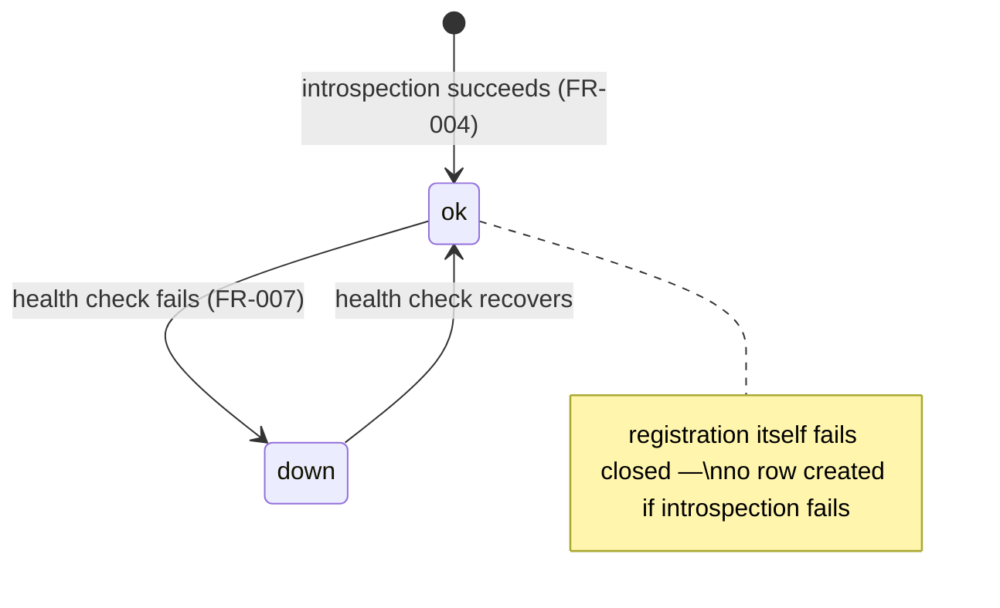
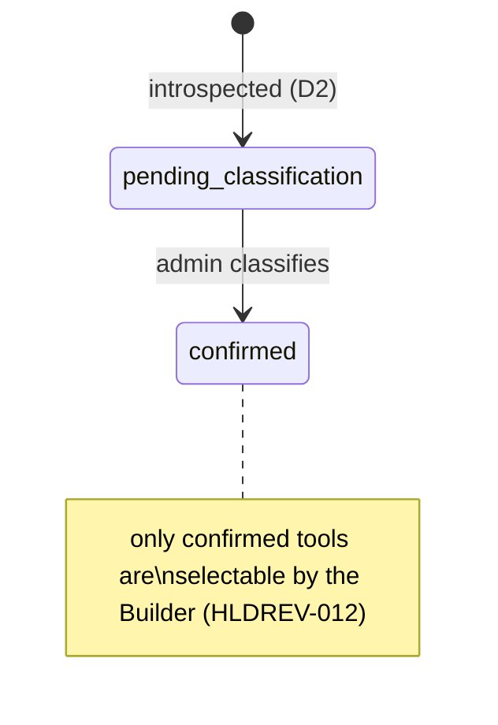
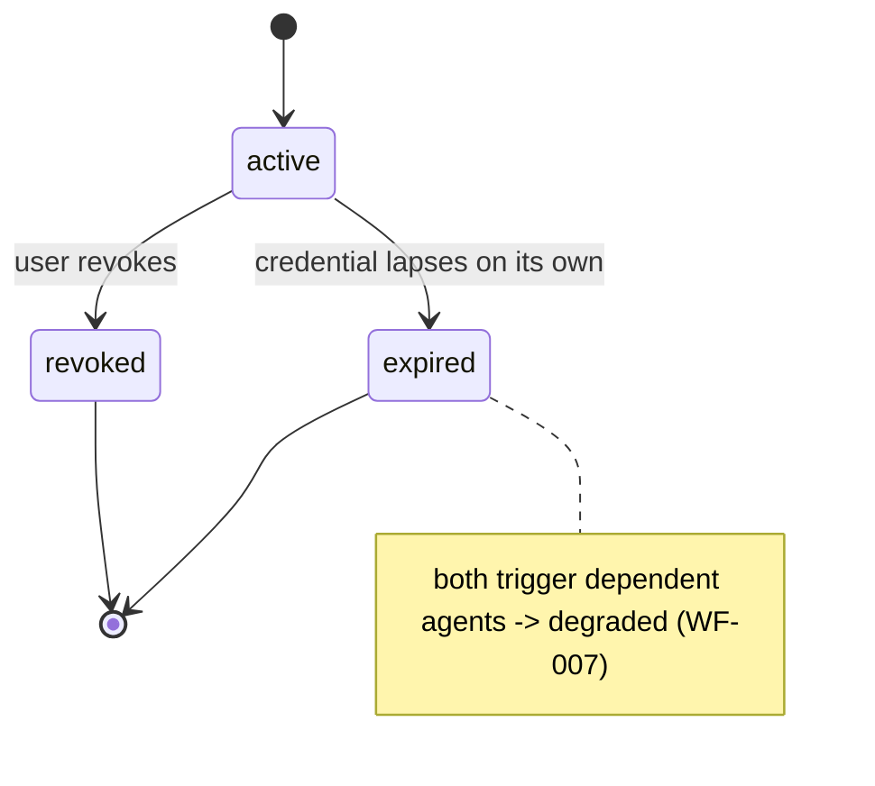
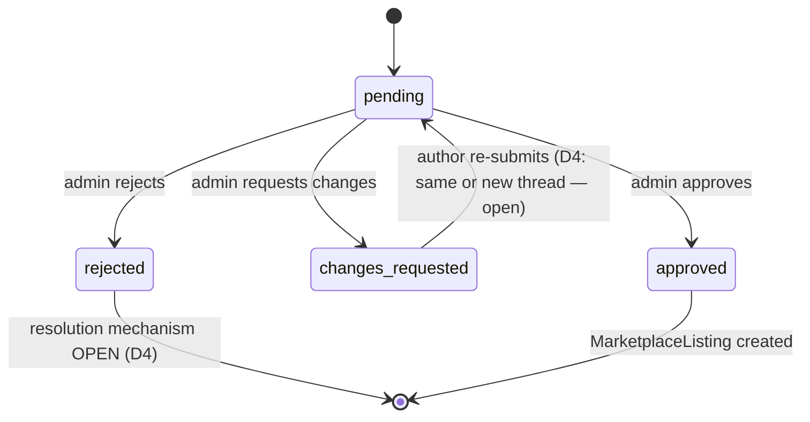
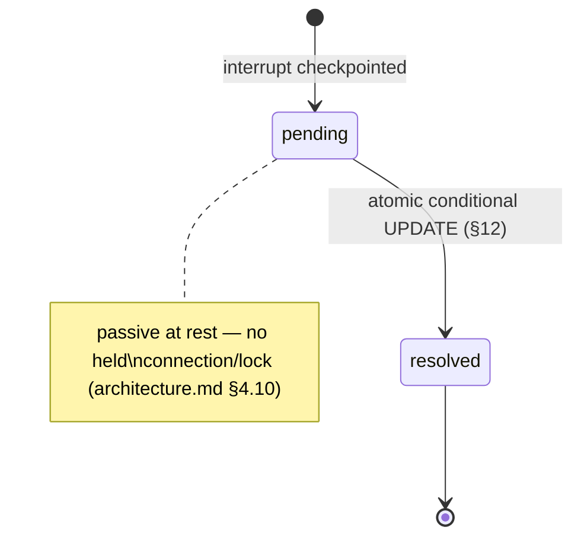

# Forge — Low-Level Design

**Status:** LLD-level — implements the approved `architecture/hld.md` (all `hld-review.md` findings applied).
Per `CLAUDE.md`'s workflow this sits before LLD REVIEW. **Does not repeat HLD's purpose/responsibility/data-
ownership text** — read `hld.md §1` for that; this document answers "how is each HLD component actually built."

**Sources:** `problem-statement/`, `specs/spec.md`, `specs/traceability.md`, `architecture/architecture.md`,
`architecture/hld.md`, `architecture/hld-review.md`.

**Justification convention used throughout:** every table, class, endpoint, and mechanism below carries one of:
a **requirement ID** (traces to `spec.md`), an **HLD ref** (traces to `hld.md §1`'s component contract), or is
marked **(implementation choice)** — something no source or HLD document mandates, decided here because LLD is
where a concrete answer is unavoidable. Nothing below is invented without one of these three labels.

**Stack, decided here (implementation choice — `spec.md C7` explicitly leaves this open):** Python + FastAPI +
LangGraph (LangGraph is itself a named requirement, `architecture.md C1` — Python is its native, most mature
runtime) + SQLAlchemy Core (not full ORM — RLS session-variable control needs explicit transaction handling,
see §8) + Postgres + a React SPA. Picked for being the least-surprising choice given LangGraph's own ecosystem,
not because it's common for its own sake.

---

## 1. Module / package structure

One package per HLD component (`hld.md §1`'s crosswalk), so the module boundary *is* the component boundary —
this is what makes `architecture.md §3`'s "modular is a promise, not a guarantee" risk enforceable by directory
structure, not just convention.

```
forge/
  api/            # HLD 1.1 — routers, ScopeGuard, IdempotencyGuard, global exception handler
  identity/       # HLD 1.2
  registry/       # HLD 1.3
  vault/          # HLD 1.4 — the only package permitted to import the encryption primitives
  graphs/
    builder.py    # HLD 1.5
    execution.py  # HLD 1.6
    review.py     # HLD 1.7
    _shared.py    # checkpointer wiring shared by all three (architecture.md's "one pattern" note)
  marketplace/    # HLD 1.8
  scoring/        # HLD 1.9
  persistence/    # HLD 1.10 — session/pool helpers, RLS helpers, Alembic migrations
  integrations/
    mcp_client/   # external MCP boundary (HLD §6)
    llm_client/   # external LLM boundary (HLD §6)
  postman/        # part of HLD 1.11
  shared/         # cross-cutting: config, exceptions, structured logging
frontend/         # HLD 1.12, separate deployable (implementation choice: React)
```

**Enforced import rule (implementation choice, enforcing `vault`'s HLD contract):** `vault/` is the only package
allowed to import the encryption module; a lint rule (import-linter or equivalent) fails CI if any other package
imports it directly — this is the concrete mechanism behind HLD 1.4's "only three entry points" contract.

---

## 2. Services / classes

One primary service class per package, method names matching HLD's named interfaces exactly (traceability from
HLD interface → LLD method is 1:1, not paraphrased):

| Class | Package | Key methods | HLD ref |
|---|---|---|---|
| `AuthService` | identity | `authenticate()`, `issue_token()`, `validate_token()` | 1.2 |
| `ScopeGuard` | api | FastAPI dependency; resolves `AuthContext`, enforces company/owner/admin shape | 1.1 |
| `IdempotencyGuard` | api | FastAPI dependency; wraps creating + resuming calls (§17) | 1.1, HLDREV-004/005 |
| `RegistryService` | registry | `register_server()`, `introspect()`, `confirm_classification()`, `health_check()` | 1.3 |
| `VaultService` | vault | `add_connection()`, `revoke_connection()`, `fetch_for_call()` | 1.4 |
| `BuilderGraph` | graphs.builder | LangGraph `StateGraph`; `start_build()`, `resume()`, `set_visibility()` | 1.5 |
| `ExecutionGraph` | graphs.execution | LangGraph `StateGraph`; `invoke()`, `resume()` | 1.6 |
| `ReviewGraph` | graphs.review | LangGraph `StateGraph`; `submit()`, `decide()` | 1.7 |
| `MarketplaceService` | marketplace | `publish()`, `install()` | 1.8 |
| `ScoringService` | scoring | `compute_grade()`, `compute_score()`, `get_checks()` | 1.9 |
| `DbSession` | persistence | `acquire(auth_context)` — the **one** shared connection helper (§8, closes HLDREV-008) | 1.10 |
| `PostmanExporter` | postman | `export(agent_id)` | 1.11 |

No class outside `vault/` holds a decrypted secret in an instance attribute — enforced by code review convention
**(implementation choice)**, since Python has no compile-time enforcement for this the way the import-linter
rule above does for module boundaries.

---

## 3. Interfaces

Three abstract boundaries, each with exactly one production implementation and a fake for tests
**(implementation choice — enables the RLS/checkpoint tests in §24 without a real Postgres in unit tests)**:

- `MCPClientProtocol` — `list_tools(endpoint, transport) -> list[Tool]`, `call_tool(endpoint, transport, name,
  args) -> ToolResult`. HLD ref: 1.3, 1.6, §6.
- `LLMClientProtocol` — `generate(messages, tools) -> LLMResponse`. HLD ref: 1.5, 1.6, §6.
- `CheckpointerProtocol` — LangGraph's own interface, not reimplemented; wrapped only to inject the RLS
  session-variable discipline from §8 before every write. HLD ref: 1.10, D6.

---

## 4. API endpoints

One route per HLD interface (`hld.md §1`), no additions beyond what HLD named. `/stream` is included but marked
per HLD's own caveat (HLDREV-007).

| Method & path | HLD interface | Auth shape |
|---|---|---|
| `POST /auth/login` | 1.2 `authenticate` | none |
| `POST /servers` | 1.3 `registerServer` | company |
| `GET /servers` | 1.3 (listing, implied by `FR-003`) | company |
| `POST /servers/{id}/tools/{tool_id}/classify` | 1.3 `confirmClassification` | admin |
| `POST /connections` | 1.4 `addConnection` | company |
| `DELETE /connections/{id}` | 1.4 `revokeConnection` | company+owner |
| `POST /agents/build` | 1.5 `startBuild` | company |
| `POST /agents/build/{thread_id}/resume` | 1.5 `resume` | company+owner |
| `PATCH /agents/{id}/visibility` | 1.5 `setVisibility` (HLDREV-002) | company+owner or admin |
| `GET /agents` | `FR-054` (My Agents listing) | company+owner (RLS-filtered) |
| `GET /agents/{id}` | `FR-025` (overview) | company+owner |
| `POST /agents/{id}/invoke` | 1.6 `invoke` / 1.11 | company+owner |
| `POST /agents/{id}/stream` | 1.11 — **P1, scope-pending (HLDREV-007)** | company+owner |
| `POST /agents/{id}/resume` | 1.6 `resume` / 1.11 | company+owner |
| `GET /agents/{id}/postman` | 1.11 | company+owner |
| `POST /agents/{id}/publish` | 1.7 `submit` | company+owner |
| `GET /submissions` | `SEC-012` (admin queue) | admin |
| `POST /submissions/{id}/decide` | 1.7 `decide` | admin |
| `GET /marketplace` | 1.8 (listing) | company (RLS exception, `hld.md §4`) |
| `GET /marketplace/{id}` | 1.8 (detail) | company (RLS exception) |
| `POST /marketplace/{id}/install` | 1.8 `install` | company |

Every route above declares its `ScopeGuard` shape (company / company+owner / admin) as a decorator argument —
this is the concrete mechanism realizing HLD 1.1's "every route declares its resource-ownership shape" contract.

---

## 5. Request / response models

Representative set (Pydantic models, **implementation choice** for the serialization library) — the pattern
below applies uniformly to every endpoint in §4, not repeated per-route to avoid inventing schema detail no
requirement asks for:

```python
class RegisterServerRequest(BaseModel):
    name: str
    transport: Literal["http", "sse", "stdio"]
    endpoint: str
    auth_type: Literal["oauth", "api_key", "none"]
    scope: Literal["tenant", "global"]   # global rejected unless caller is_admin — SEC-014

class AgentSummary(BaseModel):           # FR-054 card shape
    id: UUID
    name: str
    status: str
    servers: list[str]
    score: int | None                    # None = "not tested yet", FR-022
    grade: str
    last_run: datetime | None

class BuildResumeRequest(BaseModel):
    decision: dict                       # shape varies by interrupt type (select_tools | missing_connection)
    client_request_id: UUID              # HLDREV-004/005

class SubmissionDecisionRequest(BaseModel):
    decision: Literal["approve", "request_changes", "reject"]
    notes: str | None
```

`AgentConfiguration` itself is **not** modeled as a fixed Pydantic schema — it's stored as JSONB (§9) precisely
because `spec.md DATA-007` calls its shape "the central design problem of this capstone"; over-specifying it in
LLD would silently invent the one thing the brief explicitly left for the team to design, and this document
declines to do that. The minimal fields LLD *does* require of it (per-tool `approval_mode`, `FR-058`) are
validated by a narrow schema fragment, not the whole document.

---

## 6. Authentication flow

`POST /auth/login` → `AuthService.authenticate(email, password)` → verify against `users.password_hash`
(bcrypt, **implementation choice**) → on success, `issue_token()` mints a JWT (HS256, **implementation
choice** — D7 only mandated "bearer," not the signing algorithm) with claims `{sub: user_id, company_id,
is_admin, exp}` → client sends it as `Authorization: Bearer <token>` on every subsequent call. No refresh-token
flow **(implementation choice — not required, `NG6`/`NG7` explicitly exclude SSO/token-exchange machinery)**;
short-lived tokens with re-login on expiry is sufficient.

**Requirement/HLD justification:** `FR-001`, `FR-002`; HLD 1.2.

---

## 7. Authorization flow

Every route's `ScopeGuard` dependency: decode the bearer token → build `AuthContext(user_id, company_id,
is_admin)` → compare against the route's declared shape:
- **company** — request proceeds if the target resource's `company_id` matches.
- **company+owner** — additionally requires `owner_user_id == user_id` **or** `visibility ==
  'shared_with_company'` **or** `is_admin` (D1).
- **admin** — requires `is_admin`; used only for `/servers/*/classify` (D2) and `/submissions/*` (`SEC-012`).

Any failure raises `ResourceNotAccessible`, caught by one global exception handler that **always** returns 404,
never 403 (`SEC-002`, `SEC-011`) — see §22.

**Requirement/HLD justification:** `FR-001`, `FR-002`, `FR-054`, `FR-055`, `SEC-002`, `SEC-011`, `SEC-012`,
`SEC-014`; HLD 1.1.

---

## 8. Tenant resolution

`company_id` and `user_id` come **only** from the validated JWT claims, never from the request body, query
string, or path — a client cannot spoof its own tenant by passing a different `company_id` in a payload
**(implementation choice, enforcing `SEC-001`'s "structural, not app-code" isolation as a coding rule: no
handler function is allowed to accept `company_id` as a request field)**.

`DbSession.acquire(auth_context)` (§2) is the **one** shared helper both the app pool and the checkpoint pool
call (closing HLDREV-008): it opens a connection and immediately runs
`SET LOCAL app.company_id = :company_id; SET LOCAL app.user_id = :user_id; SET LOCAL app.is_admin = :is_admin;`
inside the transaction, before any query. Every RLS policy in §9 reads these via `current_setting(...)`. Because
this is the *only* code path that opens a DB connection anywhere in the codebase (enforced by the same
import-linter rule from §1 restricted to `persistence/`), there is no second, unscoped connection path for
`SEC-001`'s "survives the app-level check being removed" test to slip through — this is the concrete answer to
`architecture-review.md` REVARCH-010 and `hld-review.md` HLDREV-008.

**Requirement/HLD justification:** `SEC-001`, `NFR-003`; HLD 1.10.

---

## 9. Database schema

Postgres, one schema, RLS enabled on every table below except the three named exceptions (`hld.md §4`,
HLDREV-001). Tables are the minimum needed to satisfy a cited requirement or HLD-owned data — nothing added
"because a normal app would have it."

```sql
companies(id PK, name, created_at)

users(id PK, company_id FK -> companies, email UNIQUE, password_hash, is_admin, created_at)
  -- HLD 1.2, FR-001/FR-002

servers(id PK, company_id FK NULLABLE, name, transport, endpoint, auth_type, scope, status, checked_at)
  -- company_id NULL only when scope='global'; HLD 1.3, FR-003..008, SEC-014

tools(id PK, server_id FK -> servers, name, description,
      risk_status CHECK IN ('pending_classification','confirmed'),   -- D2
      risk_level CHECK IN ('read','write','destructive') NULLABLE,   -- NULL until confirmed
      confirmed_by_admin_id FK -> users NULLABLE, confirmed_at NULLABLE)
  -- HLD 1.3, FR-005, D2

connections(id PK, company_id FK, server_id FK -> servers, owner_user_id FK -> users,
            status CHECK IN ('active','expired','revoked'), encrypted_secret BYTEA,
            added_at, last_used_at)
  -- HLD 1.4, FR-009..014, SEC-003..006

agents(id PK, company_id FK, owner_user_id FK -> users, name, description, status, topology,
       visibility CHECK IN ('private_to_owner','shared_with_company'),   -- D1
       model, instructions, schedule NULLABLE,   -- display-only per D5, no executor reads it
       created_at)
  -- HLD 1.5, FR-015..024, FR-059/060

agent_configurations(id PK, agent_id FK UNIQUE -> agents, config_json JSONB, version, created_at)
  -- the DATA-007 document itself; deliberately generic, see §5. HLD 1.5, SEC-005

runs(id PK, agent_id FK -> agents, thread_id, status CHECK IN ('ok','wait','err'), trigger,
     latency_ms, cost_usd, outcome_text, started_at)
  -- HLD 1.6, FR-033/034, NFR-009

scores(id PK, agent_id FK UNIQUE -> agents, capability_score NULLABLE, governance_grade, computed_at)
  -- capability_score NULL = "not tested yet" (FR-022). HLD 1.9, FR-056/057

checks(id PK, score_id FK -> scores, ok BOOLEAN, description)
  -- HLD 1.9, FR-057, NFR-009/010

submissions(id PK, agent_id FK -> agents, company_id FK, submitted_by_user_id FK -> users,
            status CHECK IN ('pending','approved','changes_requested','rejected'),   -- reject transition: D4 open
            notes, submitted_at, decided_at, decided_by_admin_id FK NULLABLE)
  -- RLS EXCEPTION (HLDREV-001): readable by company OR any admin. HLD 1.7, FR-039..048

marketplace_listings(id PK, submission_id FK -> submissions, org_name, stripped_config_json JSONB,
                      score_snapshot, grade_snapshot, install_count, published_at)
  -- RLS EXCEPTION (HLDREV-001): globally readable once published. HLD 1.8, FR-049/050

installations(id PK, listing_id FK -> marketplace_listings, installer_company_id FK,
              installer_user_id FK -> users, new_agent_id FK -> agents, installed_at)
  -- HLD 1.8, FR-051..053, SEC-013

checkpoints(thread_id PK, graph_type CHECK IN ('builder','execution','review'), company_id FK,
            owner_user_id FK NULLABLE, state_blob, status CHECK IN ('pending','resolved'), updated_at)
  -- LangGraph's checkpoint state, with company_id/owner_user_id ADDED for RLS per D6's fallback design
  -- (see §15). HLD 1.10, NFR-006/007

idempotency_keys(client_request_id PK, endpoint, company_id, result_ref, created_at)
  -- closes HLDREV-004. HLD 1.1
```

**No separate `subagents`/`agent_tools` tables** — deliberately: `FR-059`'s topology and `FR-058`'s per-tool
approval mode live inside `agent_configurations.config_json`, not normalized out, because normalizing them would
mean *this* document silently deciding `DATA-007`'s schema instead of leaving it open as the brief requires.
**No general audit-log table** — `spec.md`'s own adversarial review (`spec-review.md`) already established the
brief doesn't require one beyond `runs`/`checks` (`NFR-009`/`010`); inventing one here would violate "don't add
requirements that were never there."

See `diagrams/lld.mmd` for the full entity-relationship diagram.

---

## 10. Tables and relationships

Relationships are the FKs declared in §9; the only non-obvious ones: `agents.owner_user_id` is a **second**
foreign key alongside `company_id` (D1's two-dimensional model, not redundant with it — an agent's owner is
always inside its company, but the two columns are independently checked by RLS, see §9's `agents` CHECK
constraints in the migration, not repeated here). `installations.new_agent_id` points to a **freshly created**
row in `agents`, never back to the original — enforcing `FR-051`'s "independent copy" at the schema level (no
FK from the original agent to the installed one exists anywhere, by design).

---

## 11. Indexes

Only indexes that serve a named access pattern — not "index everything":

```sql
UNIQUE INDEX ON users(email)                                    -- login lookup, FR-001
INDEX ON servers(company_id, scope)                             -- registry listing, FR-003
INDEX ON tools(server_id, risk_status)                          -- per-tool filtering (HLDREV-012), builder search
INDEX ON connections(company_id, owner_user_id, server_id)      -- connection existence check, FR-019
INDEX ON agents(company_id, owner_user_id, visibility)          -- My Agents listing, FR-054/055, D1
INDEX ON runs(agent_id, started_at DESC)                        -- run history, FR-033
PARTIAL INDEX ON submissions(status) WHERE status = 'pending'   -- admin queue, SEC-012
INDEX ON marketplace_listings(published_at DESC)                -- marketplace listing, FR-049
UNIQUE INDEX ON checkpoints(thread_id)
PARTIAL INDEX ON checkpoints(status) WHERE status = 'pending'    -- overnight/multi-day pending scan, NFR-007
UNIQUE INDEX ON idempotency_keys(client_request_id, endpoint)   -- HLDREV-004
```

---

## 12. Transactions

One DB transaction per HTTP request, boundary = the FastAPI request lifecycle **(implementation choice)**. Three
named transactions carry specific correctness requirements:

- **Publish gate-check + `Submission` creation** (1.7 `submit`) — reading `scores`/checking `config_json` for
  unguarded write/destructive tools and inserting the `Submission` row happen in one transaction, so a
  concurrent config edit can't slip an unguarded tool past the gate between check and insert. Justification:
  `SEC-008`, HLD 1.7.
- **Resume/decide resolution** (1.5/1.6/1.7) — `UPDATE checkpoints SET status='resolved', ... WHERE thread_id =
  :id AND status = 'pending' RETURNING *` as one atomic statement; zero rows returned means already-resolved,
  treated as an idempotent no-op. Justification: HLDREV-005.
- **Marketplace install** (1.8 `install`) — reading the stripped config, inserting the new `agents` +
  `agent_configurations` + `installations` rows all commit together or not at all; no partial-copy state is ever
  visible. Justification: `FR-051`, HLD 1.8.

---

## 13. Concurrency concerns

- **Resume race** (two near-simultaneous decisions on one interrupt): closed by §12's atomic conditional UPDATE
  — the losing request's zero-row result is treated as "already resolved," not an error. (HLDREV-005)
- **Duplicate creating calls** (`startBuild`/`submit`/`install` retried): closed by `idempotency_keys` — insert
  with `ON CONFLICT (client_request_id, endpoint) DO NOTHING RETURNING`; a conflict means "return the existing
  result," not "create a second one." (HLDREV-004)
- **Dual connection pools** (app pool, checkpoint pool) diverging in RLS discipline: closed by §8's single
  shared `DbSession.acquire()` — there is exactly one code path that can open a connection at all. (HLDREV-008)
- **Health-check racing an in-flight build** that references a server the check is about to mark `down`:
  **accepted as an eventual-consistency race, not solved (implementation choice)** — no requirement demands
  stronger consistency here, and the Builder Graph re-validates connection existence at resume-time regardless
  (§9's `connections` check), so a server going down mid-build surfaces at the next interrupt rather than being
  silently missed.

---

## 14. State machines


*Server (`hld.md §1.3`, `FR-007`/`FR-008`)*


*Tool (D2, `FR-005`)*


*Connection (`FR-013`, `WF-007`)*


*Submission (`FR-045`/`046`, D4 — reject/resubmit transitions intentionally left unresolved, matching `hld.md`*
*§2.4's diagrammed open branches, not defaulted here either)*


*Checkpoint/interrupt, shared shape across Builder/Execution/Review graphs (`NFR-006`/`007`)*

---

## 15. Workflow persistence

LangGraph's Postgres checkpointer library **(implementation choice of which specific package — e.g.
`langgraph-checkpoint-postgres` — deferred to build time, per D6)**, wrapped by `_shared.py` (§1) so every
checkpoint write goes through `DbSession.acquire()` (§8) first, setting the RLS session variables before the
library's own write executes. The `checkpoints` table (§9) **adds `company_id`/`owner_user_id` columns beyond
whatever the library's default schema provides** — this is the concrete fallback D6 named: if the chosen
library's connection handling can't be proven to honor per-request session variables, these explicit columns
plus a `CHECK` that they're never null are the enforcement mechanism instead. This must be verified against the
actual chosen library before LLD REVIEW closes — flagged, not silently assumed safe.

**Requirement/HLD justification:** `NFR-006`, `NFR-007`, `SEC-001`; HLD 1.10, D6.

---

## 16. Retries

- **Client-retried creating/resuming calls:** handled structurally by §12/§13 (idempotency keys, atomic
  updates) — not a "retry policy," a correctness guarantee that makes retries safe.
- **MCP tool-call failures:** **not automatically retried by the platform (implementation choice)** — no
  requirement asks for it; a failed tool call surfaces as a failed step to the agent/user, consistent with
  minimum-necessary-complexity.
- **LLM-provider call failures:** **one bounded retry with backoff, then surface as `err` (implementation
  choice)** — `architecture.md §6` already logs this as an assumption the brief is silent on; this is the
  concrete policy chosen to fill that gap, not a requirement.

---

## 17. Idempotency

Consolidating §12/§13: two mechanisms, not one, because they solve different problems —
`idempotency_keys` (a client-supplied key, deduplicating *creation*) for `startBuild`/`submit`/`install`/
`invoke`, and the atomic conditional `UPDATE ... WHERE status='pending'` (no client key needed — the
`thread_id` + current status is already a natural key) for `resume`/`decide`. Both close HLDREV-004/005.

---

## 18. Background jobs

One background job, running inside the same backend process — no separate worker/queue service
**(implementation choice, consistent with `architecture.md`'s rejection of Alternative C)**:

- **Server health re-check** — an `asyncio` periodic task **(implementation choice of mechanism; APScheduler
  would also satisfy this, chosen for zero extra dependency)** pings every `servers` row on an interval and
  updates `status`. Justification: `FR-007`, `WF-008`, HLD §5.

**No scheduled agent-execution job exists** — per D5, `agents.schedule` is display-only; nothing reads it.

---

## 19. External integration adapters

- **`MCPClientAdapter`** (`integrations/mcp_client/`) — implements `MCPClientProtocol` (§3) over `http`/`sse`/
  `stdio`. Treats every response as untrusted content (`hld.md §1.6`, HLDREV-009): tool names/descriptions are
  stored and displayed as opaque strings, never interpolated into anything executed.
- **`LLMClientAdapter`** (`integrations/llm_client/`) — implements `LLMClientProtocol`; points at a free-tier
  hosted model or a local model endpoint **(implementation choice of provider — `spec.md C3` only requires "no
  paid account")**.
- **`PostmanExporter`** — pure function, no external call; builds a Postman v2.1 JSON object from an agent's
  endpoint metadata, matching `AGENT:412-451`'s reference shape.

---

## 20. Secret / credential handling

`VaultService.fetch_for_call()` decrypts (AES-256-GCM, key from a Docker secret/env var — D8, **implementation
choice of algorithm**) and returns a plain string **held in a local variable inside the Execution Graph's
tool-invocation node function**, passed directly as a tool-call argument, and **never assigned to any field of
the LangGraph `AgentState` TypedDict** — enforced by code-review convention plus a unit test that asserts
`AgentState`'s field set contains no credential-shaped key (**implementation choice of enforcement mechanism**;
this is the concrete realization of `architecture.md` REVARCH-009's constraint and `hld.md §1.4/1.6`'s
carried-forward requirement). Nothing else in the codebase calls `fetch_for_call()` — grep-enforced in CI.

**Requirement/HLD justification:** `SEC-003`–`SEC-006`, `NFR-001`/`002`; HLD 1.4, 1.6.

---

## 21. Validation

- **Schema-level (Pydantic, request bodies):** type/enum validation at the API boundary — `visibility`,
  `risk_level`, `status` enums all validated here before touching the DB.
- **DB-level (`CHECK` constraints, §9):** the enum columns are also constrained at the database, so a bug
  bypassing the API layer still can't write an invalid state — defense in depth, **(implementation choice)**
  not required by any single requirement but cheap and consistent with `SEC-001`'s "don't rely on one layer"
  philosophy applied narrowly to data integrity rather than isolation.
- **Business-rule validation (`ScoringService`/`ReviewGraph`):** the publish gate (`FR-039`, `SEC-008`) —
  score/grade thresholds and "no unguarded write/destructive tool" — is application logic reading
  `config_json`, not expressible as a simple `CHECK` constraint.

---

## 22. Error handling

One global FastAPI exception handler converts every `ResourceNotAccessible` (raised by `ScopeGuard`, §7) into
HTTP 404 — this is the **single point** that can return that status for an authorization failure, so a future
change can't accidentally introduce a 403 for a cross-tenant/cross-owner case (`SEC-002`, `SEC-011`). Other
error classes: `ValidationError` → 422 (Pydantic default), `AlreadyResolvedError` (from §12's atomic-update
zero-row case) → 200 with the prior result, not an error, since a duplicate resume is expected under retry
(`SEC-007`'s approval gate isn't violated by resolving a duplicate as a no-op). Unhandled exceptions → 500,
logged with a correlation ID (§23), no internal detail in the response body **(implementation choice)**.

---

## 23. Logging / auditing

Structured (JSON-lines) logging **(implementation choice)**, with one hard rule enforced by a custom log
formatter: any log record touching a `connections` row is redacted — the formatter strips any field named
`secret`/`encrypted_secret`/`credential` before a record is emitted, regardless of log level, closing `SEC-004`'s
"unbounded, not a named list" guarantee specifically against the logging surface (traces/checkpoints are closed
separately in §15/§20). **No general audit-log table is added** — `runs` and `submissions.checks` (§9) are the
audit trail `NFR-009`/`NFR-010` actually require; nothing broader is invented (same discipline `spec-review.md`
already applied to this exact question).

**Requirement/HLD justification:** `SEC-004`, `NFR-002`, `NFR-009`, `NFR-010`.

---

## 24. Test strategy

Refines `hld.md §3`'s testability table to concrete test types — one test class per graded check, not a vague
"we'll test it":

| Graded check | Test | Mechanism |
|---|---|---|
| `TEST-001` | RLS integration test | Connect as a low-privilege DB role with `app.company_id` set to company B, attempt to read company A's `agents` row with the app-level `ScopeGuard` bypassed entirely (raw SQL) — must return zero rows |
| `TEST-002` | Credential-search test | Insert a known token via `VaultService`, then grep every table + every emitted log line + the `checkpoints.state_blob` column for the raw value |
| `TEST-003` | Publish-gate test | Build an agent with an unguarded write tool, assert `POST /agents/{id}/publish` is rejected |
| `TEST-004` | Stripping test | Plant a fake secret string in `agent_configurations.instructions`, publish, assert it's absent from `marketplace_listings.stripped_config_json` |
| `TEST-005` | Kill-mid-build test | `SIGKILL` the process after the first interrupt checkpoint commits, restart, resume, assert correct state |
| `TEST-006` | Overnight-approval test | Manually advance the `checkpoints.updated_at` clock (or wait), assert resume still succeeds after restart |
| `TEST-007` | Multi-agent end-to-end test | Run the mandatory demo agent through `ExecutionGraph.invoke()` including its approval step |
| `TEST-008` | Postman round-trip test | Export via `PostmanExporter`, replay the exported request against a live test server, assert a real response |
| `TEST-009` | 404-masking test | Call `/agents/{other_company_agent_id}` with a valid-but-wrong-company token, assert exactly 404 |
| `TEST-010` | N/A (presentation) | Not automatable — covered by rehearsal, not a test suite |

Unit tests (per-class, `pytest` — **implementation choice**) cover §2's service classes in isolation using the
fakes from §3. Integration tests above run against a real Postgres (via `testcontainers` or a `docker compose`
test profile — **implementation choice**), since RLS and checkpoint durability are exactly the properties a
mocked DB cannot verify.

---

## Remaining open items carried into LLD REVIEW

- D3 (admin provisioning), D4 (Reject/resubmission — `submissions.status` transitions left partially open in
  §14), D6 (checkpointer library verification, §15) — unchanged from `hld.md`, not resolved here either.
- `spec.md §16` item 5 (`DATA-007` schema) — deliberately still not fully specified; §9/§5 explain why.
- The specific LangGraph checkpointer package and LLM provider are named as **(implementation choice, deferred)**
  — picking them is a build-time decision, not a design one.
